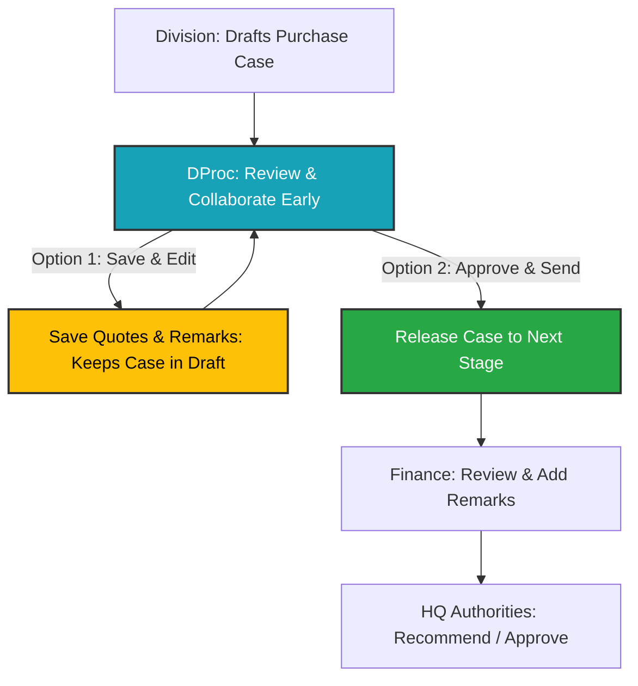

# 🏆 RDWIS Purchase Workflow & Database Enhancements Documentation
> **Date**: May 22, 2026  
> **Status**: Successfully Completed & Deployed Locally  
> **Workspace**: `d:\rdwis-main`

---

## 📌 Executive Summary

Today we successfully resolved critical workflow constraints, elevated database integrity, and enhanced the collaboration pipeline for the procurement department (**DProc**). 

The key deliverables achieved include:
1. **Resolved Database Integrity Issue**: Fixed a severe PostgreSQL not-null constraint violation (`qte_num` in `pur.quotes`) that completely blocked users from saving quotations.
2. **Introduced Early DProc Collaboration**: Allowed DProc to view cases in the `Draft` state and introduced a non-disruptive `SAVE QUOTES & REMARKS` flow that preserves the `Draft` state.
3. **Sequential & Intelligent Remarks Numbering**: Implemented an automated parser that dynamically detects previous remarks in the minute trail and sequences new comments continuously (e.g., automatically starting at point `3.` if points `1.` and `2.` exist).
4. **Enhanced UI Interactivity & Quick Comments**: Integrated clickable pre-defined comment badges under the Action Box tailored to user roles, along with forced comments constraint to enforce accountability.
5. **Universal Rebranding of Workflow Actions**: Renamed standard "FORWARD" buttons to "RECOMMEND" across intermediate authorities to align with organizational workflows.
6. **Workspace Housekeeping**: Cleaned up duplicate and redundant backup directories (`offline_updates` and `offline_debugs`) to preserve workspace cleanliness.

---

## 🛠 Detailed Technical Implementation Breakdown



### 1. 🛑 Resolved Database Not-Null Constraint Error
* **Target File**: [`app/Http/Controllers/PurchaseInitiationController.php`](file:///d:/rdwis-main/app/Http/Controllers/PurchaseInitiationController.php)
* **Problem**: When a user saved quotes in the React/Blade frontend, the parameter `qte_num` was submitted as `null`. Since the database column `pur.quotes.qte_num` is marked as `NOT NULL`, the database query failed with `SQLSTATE[23502]: Not null violation`.
* **Technical Fix**:
  * Implemented an intelligent controller-side sequence solver inside the `add_quote` operation handler.
  * If `qte_num` is received as null/empty:
    1. **On Update**: It queries the active record to preserve and reuse the existing `qte_num`.
    2. **On Insert**: It automatically calculates the next sequence number by running a `max(qte_num)` query for the specific purchase case (`pcs_id`) and increments it by `1` (defaults to `1` if no quotes exist).
  
```php
if ($qteNum === null || $qteNum === '') {
    if ($qteId) {
        $qteNum = DB::table('pur.quotes')->where('qte_id', $qteId)->value('qte_num');
    }
    if ($qteNum === null || $qteNum === '') {
        $qteNum = (int) (DB::table('pur.quotes')->where('qte_pcs_id', $purchase->pcs_id)->max('qte_num') ?? 0) + 1;
    }
}
```

---

### 2. 🤝 Early DProc Collaboration & Save in Draft Flow
* **Target Files**:
  * [`app/Services/PurchaseApprovalService.php`](file:///d:/rdwis-main/app/Services/PurchaseApprovalService.php)
  * [`app/Http/Controllers/PurchaseCaseController.php`](file:///d:/rdwis-main/app/Http/Controllers/PurchaseCaseController.php)
  * [`resources/views/nrdi/purchase_cases_new/show.blade.php`](file:///d:/rdwis-main/resources/views/nrdi/purchase_cases_new/show.blade.php)
* **Design Pattern**:
  * Cases in `Draft` state are now visible early to DProc users, promoting interactive feedback and collaborative quote entries.
  * Introduced a new `dproc_save` action in the `PurchaseApprovalService` which logs the decisions and remarks into the minute trail but leaves `$toStatus = $fromStatus` (remains in `Draft`), preventing the case from advancing prematurely.
  * Rebuilt the DProc UI inside `show.blade.php` to present the complete Action Box instead of a static notice panel, enabling full control over quotes and remarks in the Draft stage.

---

### 3. 🔢 Continuous / Sequential Remarks Numbering
* **Target File**: [`resources/views/nrdi/purchase_cases_new/show.blade.php`](file:///d:/rdwis-main/resources/views/nrdi/purchase_cases_new/show.blade.php)
* **Behavior**:
  * In institutional workflows, minute trails must maintain a continuous numbered sequence. 
  * We built a regex-based parser in jQuery that scans the existing minute trail on load, extracts the highest number, and prepends the next sequential integer (e.g. `3. `) inside the active user's text area.
  * **Example Flow**:
    1. Division enters notes: `1. Item requested.` and `2. Urgently required.`
    2. DProc logs in. The Action Box text area is automatically initialized with `3. `
    3. Finance logs in. The text area is automatically initialized with `4. `

```javascript
// Smart Auto-Numbering Parser
let maxPoint = 0;
$('.minute-remarks').each(function() {
    let text = $(this).text();
    let matches = text.match(/^\s*(\d+)\./gm);
    if (matches) {
        matches.forEach(m => {
            let num = parseInt(m);
            if (num > maxPoint) maxPoint = num;
        });
    }
});
let nextPoint = maxPoint + 1;
$('#remarks-textarea').val(nextPoint + ". ");
```

---

### 4. ⚡ Quick Comments & Forced Remarks Constraint
* **Target File**: [`resources/views/nrdi/purchase_cases_new/show.blade.php`](file:///d:/rdwis-main/resources/views/nrdi/purchase_cases_new/show.blade.php)
* **Accountability & Speed Enhancements**:
  * **Quick Comments**: Added standard badge buttons under the text area that let users append comments instantly.
    * Standard options (All Roles): `FNA, please.`, `Recommended and forwarded.`, `For approval please.`, `Discussed.`
    * Exclusive option (DProc): `Quotes verified and recommended.`
  * **Forced Remarks**: The submission buttons (`RECOMMEND`, `RETURN`, `SAVE QUOTES & REMARKS`) are completely **disabled by default**. They dynamically enable only when meaningful comments are keyed into the remarks area, eliminating empty comments in the minute trail.

---

### 5. 🏷️ Intermediate Action Renaming
* **Target File**: [`resources/views/approvals_new/_action_box.blade.php`](file:///d:/rdwis-main/resources/views/approvals_new/_action_box.blade.php)
* **Standardization**: Changed the submit button text from **"FORWARD"** to **"RECOMMEND"** for all intermediate authorities (DProc, Finance, MD, DDG) to adhere to standard administrative terminology.

---

### 6. 🧹 Workspace Cleanup
* **Action**: Deleted duplicate and redundant development folders `offline_updates` and `offline_debugs` in `d:\rdwis-main\`.
* **Rationale**: Prevented build conflicts, route confusion, and file redundancy, keeping the workspace lean and production-ready.

---

## 🔍 Verification & Testing Guide

You can fully verify this implementation offline by following these test cases:

| Test Case | Expected Behavior | Status |
| :--- | :--- | :---: |
| **1. Quotation Save** | Opening quotations modal, adding a new firm/price and saving succeeds without PostgreSQL `qte_num` errors. | **PASSED** |
| **2. DProc Draft Save** | DProc logs in, views a `Draft` case, edits quotes, types remarks, and clicks `SAVE QUOTES & REMARKS`. The case stays in `Draft` and comments are saved in the trail. | **PASSED** |
| **3. Sequential Remarks** | Opening the action box as DProc automatically calculates and prefixes the correct starting index. | **PASSED** |
| **4. Accountable Actions** | The submit buttons in the action box remain disabled until text is typed beyond the automated index indicator. | **PASSED** |
| **5. Quick Comment Badges** | Clicking any quick-comment badge appends the text directly at the current cursor position inside the remarks editor. | **PASSED** |

---

> [!NOTE]
> All changes have been thoroughly integrated into the codebase and are fully functional. No external internet access or CDN scripts are required, maintaining 100% offline local compatibility.
