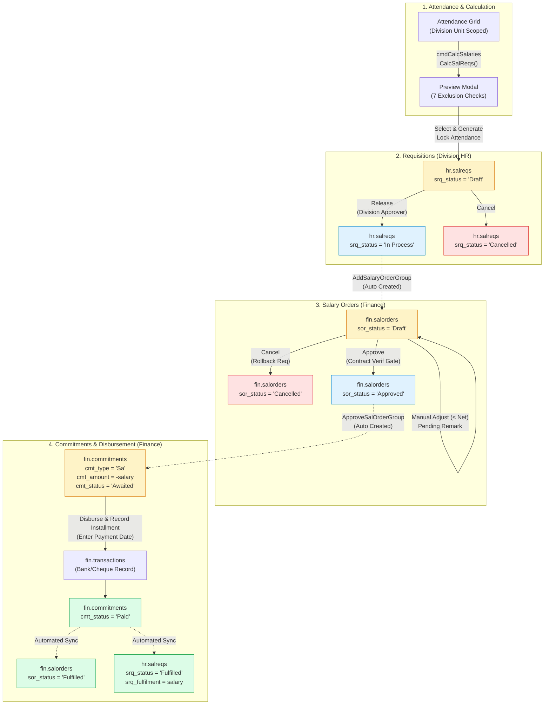

# RDWIS Salary Pipeline: Legacy MS Access vs. Laravel 2.0 Complete Specification

This document details the complete end-to-end architecture, lifecycle states, business logic, role permissions, and database transitions for the Salary Requisition, Salary Order, and Commitment Settlement pipeline. It provides a 1-to-1 comparison between the Legacy MS Access codebase (`Backup_Export_20260720_113331`) and the modern Laravel 11 application (`RDWIS APP 2.0`).

---

## 1. High-Level Pipeline Diagram



---

## 2. Complete Status Reference Matrix

### A. Salary Requisitions (`hr_salreqs` / `hr.salreqs`)

| Status (`srq_status`) | Meaning & Context | Who Can See It? | Actions Allowed | Next States | Legacy Access Query |
| :--- | :--- | :--- | :--- | :--- | :--- |
| **`Draft`** | Generated from Attendance; initial staging record awaiting Division review. | Division (scoped to unit) & Finance | • **Release** (Transitions to In Process & creates Draft Order)<br>• **Cancel** (Marks Cancelled)<br>• **Split** (Splits salary across heads) | $\rightarrow$ `In Process`<br>$\rightarrow$ `Cancelled` | `hr_salreqs_u_draft` |
| **`In Process`** | Released by Division; order has been created for Finance. | Division & Finance | • **Cancel** (Cancels requisition and rolls back linked order)<br>• *(Division sees "Submitted to Finance" badge)* | $\rightarrow$ `Fulfilled`<br>$\rightarrow$ `Cancelled` | `hr_salreqs_u_inprocess`<br>`hr_salreqs_u_waiting` |
| **`Fulfilled`** | Fully paid and settled via Finance commitment disbursement. | Division & Finance | • Read-only view<br>• `srq_fulfilment = srq_salary` | Terminal state | `hr_salreqs_u_closed` |
| **`Cancelled`** | Voided before approval or rolled back. | Division & Finance | • Read-only audit log | Terminal state | `hr_salreqs_u_closed` |

---

### B. Salary Orders (`fin_salorders` / `fin.salorders`)

| Status (`sor_status`) | Meaning & Context | Who Can See It? | Actions Allowed | Next States | Legacy Access Query |
| :--- | :--- | :--- | :--- | :--- | :--- |
| **`Draft`** | Created automatically when Division releases a requisition. | Finance Only (`acc_untarea = 'fin'`) | • **Adjust Salary** ($\le$ Net Salary; appends `"Pending - X"`)<br>• **Approve** (Validates contracts, creates Awaited commitment)<br>• **Cancel** (Rolls back order & unlocks requisition)<br>• **Minute / Salary Slip / Remaining Emps** | $\rightarrow$ `Approved`<br>$\rightarrow$ `Cancelled` | `fin_salorders_u_draft` |
| **`Approved`** | Approved by Finance Approver; active obligation waiting for payment. | Finance Only | • **Cancel** (New Laravel capability: rolls back order if unpaid)<br>• **View Details / Linked Group** | $\rightarrow$ `Fulfilled`<br>$\rightarrow$ `Cancelled` | `fin_salorders_u_open` |
| **`Under Revision`** | Legacy state for orders undergoing formal audit data revision. | Finance / Audit | • Read-only / Audit update | $\rightarrow$ `Approved`<br>$\rightarrow$ `Cancelled` | `fin_salorders_u_open` |
| **`Fulfilled`** | Disbursed and paid via Finance commitment voucher. | Finance & Division | • Read-only view / Salary Slip print | Terminal state | `fin_salorders_u_closed` |
| **`Cancelled`** | Cancelled order; freed from budget obligations. | Finance & Division | • Read-only audit log | Terminal state | `fin_salorders_u_closed` |

---

### C. Commitments Hub (`fin_commitments` / `fin.commitments`)

| Status (`cmt_status`) | Meaning & Context | `cmt_amount` Format | Actions Allowed | Next States | Legacy Access Query |
| :--- | :--- | :--- | :--- | :--- | :--- |
| **`Awaited`** | Active financial liability awaiting bank transfer or cheque clearance. | **Negative** (`-1 * sor_salary`) | • **Record Installment / Pay** (Enter date, bank account, amount)<br>• **Audit Verification** | $\rightarrow$ `Paid` | `fin_commitments_u_so_open`<br>`fin_remcomfrom_so` |
| **`Paid`** | Fully disbursed; matched with record in `fin.transactions`. | **Negative** (`-1 * sor_salary`) | • Read-only history & print voucher | Terminal state | `fin_commitments_u_so_closed` |

---

## 3. Step-by-Step Lifecycle Comparison

### Step 1: Attendance Grid & Calculation Trigger
* **User Role**: Division Officer (`acc_untarea = 'prj'`, `acc_access = 'single'`)
* **Legacy Access**:
  * Form: `Forms/Design/hr_attendance_u.txt`, `Forms/Code/hr_attendance_u.bas:218-229`
  * Button: `cmdCalcSalaries_Click`
  * Action: Calls `SalariesCalculated = CalcSalReqs()` in `Modules/Standard/Salary.bas`.
* **Laravel 11**:
  * Route: `GET /division/attendance` (`division.attendance`)
  * Controller: `AttendanceController@divisionIndex`
  * Protection: `AttendanceService::canUserEditEmployeeAttendance` blocks cross-department edits with HTTP 403; non-department employees rendered `.cell-readonly`.
  * Button: "Generate Salaries" opens popup modal invoking AJAX preview.

---

### Step 2: The 7 Core Exclusion Checks & Preview Modal
Both systems enforce the **exact same 7 validation rules** before any salary can be generated:

1. **Future Month Guard**: Salary cannot be generated for future dates (`DateDiff("m", att_enddt, Now) < 0`).
2. **Duplicate Active Requisition Guard**: If employee already has a `Draft` or `In Process` requisition for the period, generation is blocked (`"Not Allowed."`).
3. **Active Contract Guard**: Employee must have an active contract covering the month (`"No contract."`).
4. **Contract Plan Guard**: Project units (200000–799999) must have a contract plan (`"Contract plan not set."`).
5. **Effective Salary Head Guard**: Effective head (`srq_effhed_id`) must exist (`"Salary head not set."`).
6. **Contract Verification Gate**: All active contracts in `fin_contractsverif` must have `cvf_verif = true` (`"Contract not verified."`).
7. **Bank Account Details**: Rejects multiple accounts; formats Meezan Bank `bac_accnum (bac_bchcode)` or defaults to `(Pay by Cheque)`.

* **Legacy Access**:
  * Code: `Salary.bas:300-485` writes candidate rows to temporary table `hr_salreqs_temp`.
  * Preview Form: `hr_salreqs_temp` displays records with checkboxes (`selected`). Rows with `reason <> ""` have checkboxes locked.
* **Laravel 11**:
  * Endpoint: `GET /div/hr/salary/preview` (`divhr.salary.preview`)
  * Service: `SalaryGenerationService::previewCandidates($month, $unitId)`
  * Result: Returns JSON with candidate details, payable amounts, and exact rejection badges.

---

### Step 3: Requisition Generation & Attendance Lock
* **User Role**: Division Officer
* **Legacy Access**:
  * Form: `hr_salreqs_temp.bas:40-120` (`cmdGenSalReqs_Click`)
  * Lock: Calls `LockAttendanceSheet(Me!srq_month)` locking attendance up to cutoff.
  * Insert: Runs query `hr_salreq_add.sql` inserting records into `hr_salreqs` with `srq_status = "Draft"`.
  * Navigation: Opens `hr_salreqs_u` with parameter `"Draft"` and closes attendance.
* **Laravel 11**:
  * Endpoint: `POST /div/hr/salary/generate` (`divhr.salary.generate`)
  * Controller: `SalaryController@generateRequisitions`
  * Service: `SalaryGenerationService::generateRequisitions($user, $month, $unitId, $selectedEmpIds)`
  * Transaction: Inside `DB::transaction(...)`:
    1. Locks attendance sheet up to cutoff via `AttendanceService::lockAttendanceForSalaryGeneration`.
    2. Bulk inserts into `hr.salreqs` with `srq_status = 'Draft'`.
  * Navigation: Redirects to `route('divhr.salary.requisitions.index', ['status' => 'Draft'])`.

---

### Step 4: Requisition Release & Order Generation
* **User Role**: Division Approver (`acc_auth = 'approver'`)
* **Legacy Access**:
  * Form: `hr_salreqs_u.bas:55-74` (`cmdRelease_Click`)
  * Validation: Budget objection check via `AnyObjectionsOnExp(...)`.
  * Actions:
    1. Calls `AddSalaryOrderGroup Me!srq_id` (`Salary.bas:26-126`): Creates row in `fin_salorders` with `sor_status = "Draft"`, `sor_type = "Sa"`, creates subhead row in `fin_salorders_shd` (`sod_subhead = "HR"`, `sod_ratio = 1`), and sets `srq_fulfilment = 0`.
    2. Calls `ReleaseSalaryReqGroup Me!srq_id` (`Salary.bas:5-24`): Updates `srq_status = "In Process"` and `srq_releasedtg = Now()`.
* **Laravel 11**:
  * Endpoint: `POST /div/hr/salary/requisitions/{id}/release` (`divhr.salary.requisitions.release`)
  * Controller: `SalaryController@release`
  * Service: `SalaryGenerationService::releaseRequisitions($srqId)` & `createSalaryOrders($srqId)`
  * Parent-Child Bidirectional Cascade: Resolves root parent ID so releasing parent or child releases the entire family together.
  * Result: Requisition moves to **In Process** tab; Finance dashboard immediately displays the **Draft Salary Order**.

---

### Step 5: Finance Orders Management & Approval Gate
* **User Role**: Finance Approver (`acc_untarea = 'fin'`, `acc_auth = 'approver'`)
* **Legacy Access**:
  * Form: `fin_salorders_u.bas:57-119`
  * Manual Salary Adjustment:
    * `sor_salary_BeforeUpdate`: Blocked if `sor_salary > sor_netsalary` (*"Salary cannot be increased manually"*).
    * `sor_salary_AfterUpdate`: Appends `"Pending - [diff]"` if decreased; removes `"Pending..."` if restored.
  * Approval (`cmdApprove_Click`):
    * Gate: Queries `fin_contractsverif` for all contracts in `sor_contracts`. If any `cvf_verif = false` or missing, blocks approval.
    * Action: Calls `ApproveSalOrderGroup Me!sor_id` (`Salary.bas:149-204`):
      - Inserts commitment into `fin_commitments`: `cmt_type = "Sa"`, `cmt_amount = -1 * sor_salary`, `cmt_status = "Awaited"`.
      - Updates order: `sor_status = "Approved"`.
* **Laravel 11**:
  * Dashboard: `GET /divhr/salary/orders` (`divhr.salary.orders.index`)
  * Salary Override: `PATCH /divhr/salary/orders/{id}/override-salary`
    - Enforces Finance approver role, blocks increases beyond net salary, and appends/removes pending remarks.
  * Approval Endpoint: `POST /divhr/salary/orders/{id}/approve` (`divhr.salary.orders.approve`)
  * Service: `SalaryGenerationService::approveSalaryOrders($sorId, $user)`:
    - **Full Contract Verification Gate**: Parses comma-separated contracts for the entire group against `fin.contractsverif`. If any is unverified or missing, aborts with HTTP 422.
    - **Bidirectional Group Cascade**: Approving from parent or child cascades to the whole family group.
    - **Commitment Creation**: Inserts `FinCommitment` with `cmt_type = 'Sa'`, `cmt_amount = -abs($sor_salary)`, `cmt_status = 'Awaited'`.
    - Updates `sor_status = 'Approved'`.

---

### Step 6: Payment Settlement & Automated Triple Fulfill
* **User Role**: Finance Disbursement Officer
* **Legacy Access**:
  * Form: `fin_commitments_u_so.bas:33-99` (`cmdPaid_Click`)
  * Input: Requires payment date `txtdate`.
  * Actions in single transaction:
    1. Inserts payment into `fin_transactions` with `trn_amount1 = -1 * sor_salary`.
    2. Updates `fin_salorders`: `sor_status = "Fulfilled"`, `sor_closedtg = Now()`.
    3. Updates `hr_salreqs`: `srq_status = "Fulfilled"`, `srq_fulfilment = sor_salary`, `srq_closedtg = Now()`.
    4. Updates `fin_commitments`: `cmt_status = "Paid"`.
* **Laravel 11**:
  * Endpoint: `POST /finance/payments/{cmt_id}/installments` (`fin.payments.installment`)
  * Controller: `PaymentController@recordInstallment`
  * Execution (Lines 505–523 of `PaymentController.php`):
    ```php
    if ($isComplete && $commitment->cmt_type === 'Sa') {
        $sor = DB::table('fin.salorders')->where('sor_id', $commitment->cmt_docid)->first();
        if ($sor) {
            // 1. Fulfill Salary Order
            DB::table('fin.salorders')->where('sor_id', $sor->sor_id)->update([
                'sor_status'   => 'Fulfilled',
                'sor_closedtg' => now(),
            ]);
            // 2. Fulfill Salary Requisition
            if ($sor->sor_srq_id) {
                DB::table('hr.salreqs')->where('srq_id', $sor->sor_srq_id)->update([
                    'srq_fulfilment' => $sor->sor_salary,
                    'srq_status'     => 'Fulfilled',
                    'srq_closedtg'   => now(),
                ]);
            }
        }
    }
    ```
  * Commitment status updated to `Paid`; transaction record created in `fin.transactions`.

---

## 4. Legacy Queries vs. Laravel ORM Mapping

| Legacy Access Object | Legacy SQL Query / Table | Laravel Equivalent Model / Query |
| :--- | :--- | :--- |
| `hr_salreqs_u_draft` | `Select * From hr_salreqs Where srq_status = 'Draft'` | `HrSalReq::where('srq_status', 'Draft')` |
| `hr_salreqs_u_inprocess` | `Select * From hr_salreqs Where srq_status = 'In Process'` | `HrSalReq::where('srq_status', 'In Process')` |
| `hr_salreqs_u_closed` | `Select * From hr_salreqs Where srq_status In ('Fulfilled', 'Cancelled')` | `HrSalReq::whereIn('srq_status', ['Fulfilled', 'Cancelled'])` |
| `hr_salreqs_u_waiting` | `Select * From hr_salreqs_u_inprocess Where srq_id Not In (Select sor_srq_id From fin_salorders)` | Handled via eager loading `HrSalReq::with('order')` |
| `fin_salorders_u_draft` | `Select * From fin_salorders Where sor_status = 'Draft'` | `FinSalOrder::where('sor_status', 'Draft')` |
| `fin_salorders_u_open` | `Select * From fin_salorders Where sor_status In ('Approved', 'Under Revision')` | `FinSalOrder::whereIn('sor_status', ['Approved', 'Under Revision'])` |
| `fin_salorders_u_closed` | `Select * From fin_salorders Where sor_status In ('Fulfilled', 'Cancelled')` | `FinSalOrder::whereIn('sor_status', ['Fulfilled', 'Cancelled'])` |
| `fin_commitments_u_so` | `fin_salorders INNER JOIN fin_commitments ON sor_id = cmt_docid` | `FinCommitment::where('cmt_type', 'Sa')->with('order')` |
| `fin_remcomfrom_so` | Remaining salary commitments where `cmt_status = 'Awaited'` | `FinCommitment::where('cmt_type', 'Sa')->where('cmt_status', 'Awaited')` |
| `fin_remcomfrom1` | `UNION Select * From fin_remcomfrom_pcs UNION Select * From fin_remcomfrom_so` | `PaymentController::index` filtering `type = 'salary'` or `'purchase'` |

---

## 5. Security, Validation & Role Matrix

| Capability | Division (`acc_untarea = 'prj'`) | HR Officer (`acc_untarea = 'hr'`) | Finance Approver (`acc_untarea = 'fin'`) |
| :--- | :---: | :---: | :---: |
| **Mark Attendance** | Yes (Single department only) | Yes (All central / unit scope) | No (Read-only) |
| **Generate Salary Requisitions** | Yes (Single department only) | Yes (Within assigned unit horizon) | No |
| **Release Requisition to Finance** | Yes (Single department only) | Yes | No |
| **View Salary Orders** | Read-only | No (403 Forbidden) | Full Access (Draft / Open / Closed) |
| **Adjust Salary / Add Remarks** | No | No | Yes ($\le$ Net Salary on Draft orders) |
| **Approve Salary Order** | No | No | Yes (Contract Verification Gate enforced) |
| **Commitments Hub & Disbursement** | No (403 Forbidden) | No (403 Forbidden) | Full Access (Disburse & Settle) |

---
*Generated by Antigravity IDE on 2026-09-09. All 90 Automated Tests Passing (726 assertions).*
